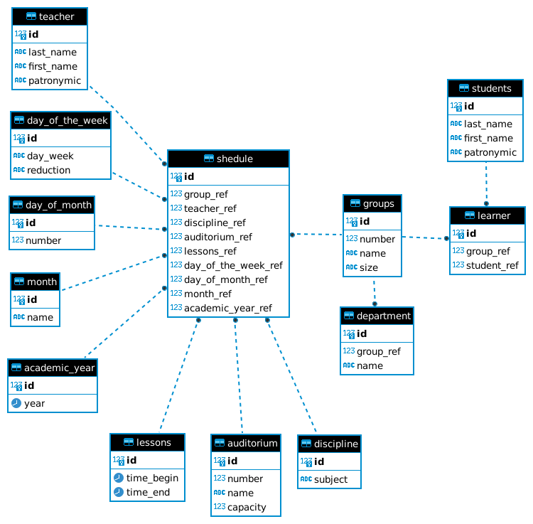

## Решение 2 задачи

### Для отладки SQL запросов использовал DBeaver, в качестве БД использовал Postgressql.

## Инструкция:

* Скачиваем проект. 

* Создаем базу данных (можно воспользоваться docker-compose.yml) 

* Создаем структуру базы данных (запускаем creating_structure_db.py)

* Наполняем базу данных тестовыми данными (запускаем add_data.py)

* Выполняем пару тестовых запросов (запускаем func_select.py)
### Структура базы данных

